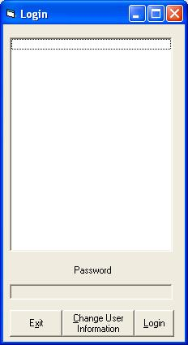



## Access Database Look Up Login Screen

### Description

Login screen that looks into an Access Database which stores the user names and passwords and verifies them and acts as a normal login screen!!!

Made in VB6                         Please Vote!!
 
### More Info
 

             |
---                |---
**Submitted On**   |2003-02-19 19:08:10
**By**             |[Timothy E\. Mertz](https://github.com/Planet-Source-Code/PSCIndex/blob/master/ByAuthor/timothy-e-mertz.md)
**Level**          |Intermediate
**User Rating**    |4.7 (33 globes from 7 users)
**Compatibility**  |VB 6\.0
**Category**       |[Miscellaneous](https://github.com/Planet-Source-Code/PSCIndex/blob/master/ByCategory/miscellaneous__1-1.md)
**World**          |[Visual Basic](https://github.com/Planet-Source-Code/PSCIndex/blob/master/ByWorld/visual-basic.md)
**Archive File**   |[Access\_Dat1547202192003\.zip](https://github.com/Planet-Source-Code/timothy-e-mertz-access-database-look-up-login-screen__1-43363/archive/master.zip)

